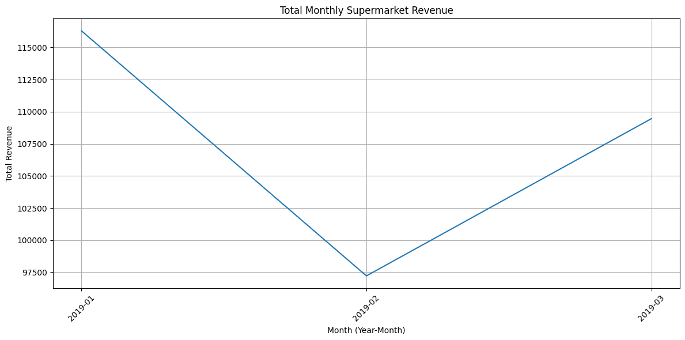
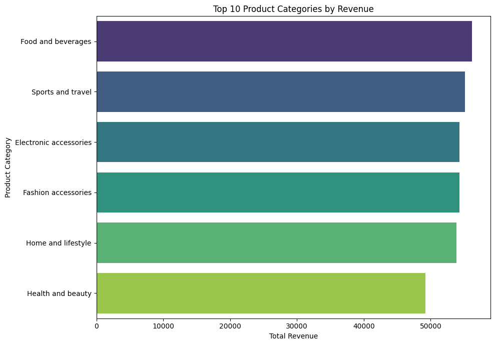
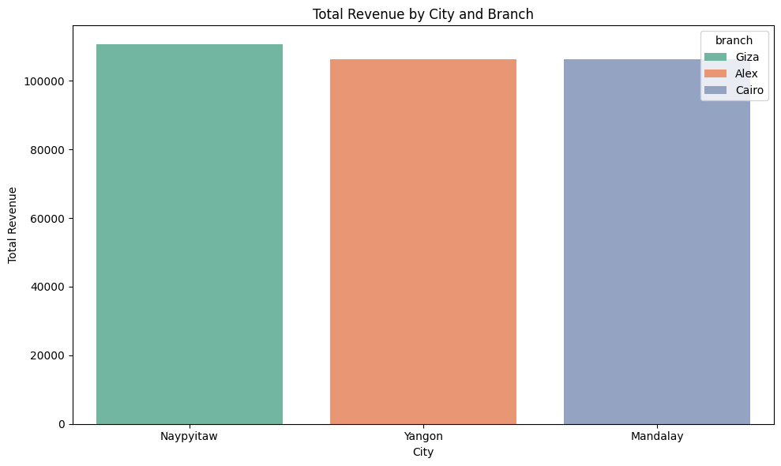
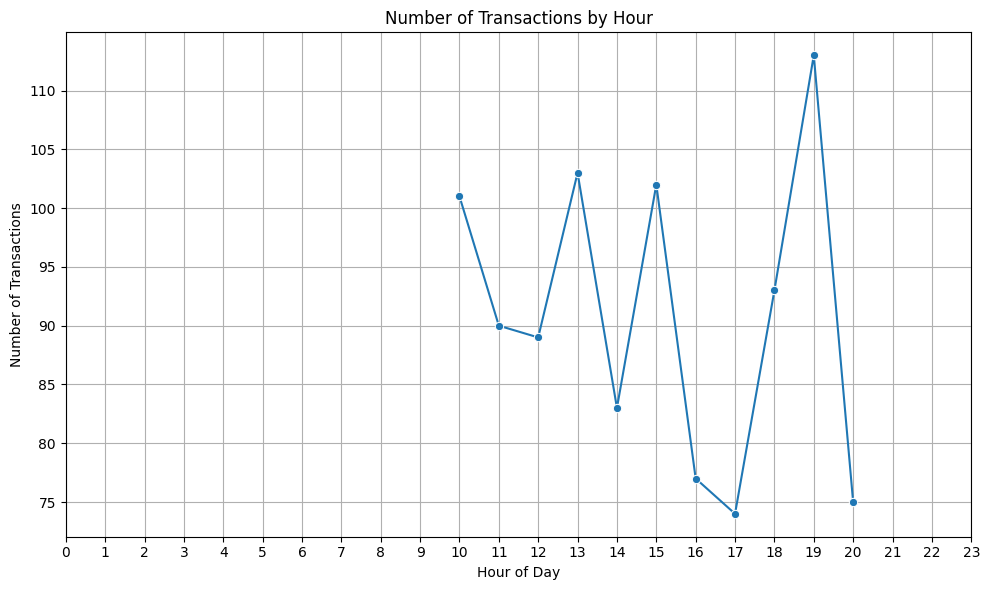
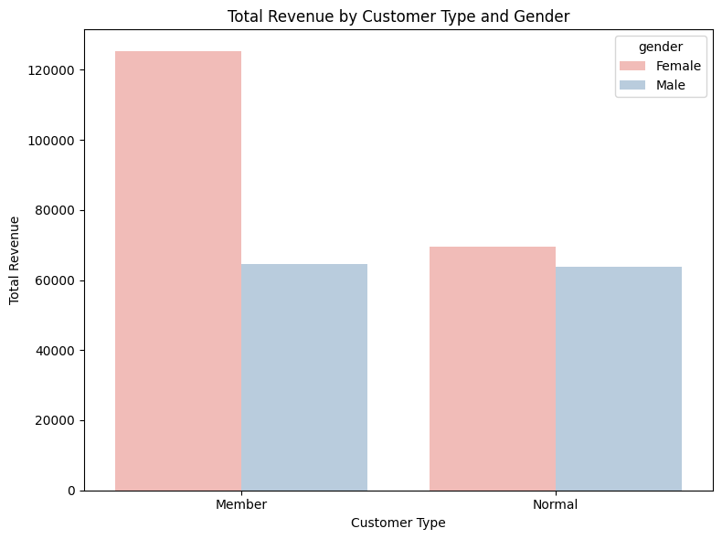
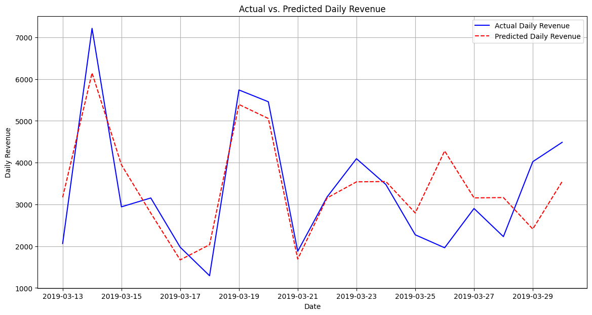

# Supermarket Sales Analytics: Unleashing Insights for Growth & Efficiency

## Proyek Data Analytics dengan PySpark

---

## Daftar Isi
1.  [Pendahuluan & Latar Belakang](#pendahuluan--latar-belakang)
2.  [Pertanyaan Bisnis](#pertanyaan-bisnis)
3.  [Dataset](#dataset)
4.  [Metodologi](#metodologi)
    * [Eksplorasi Data (EDA)](#eksplorasi-data-eda)
    * [Pembersihan Data (Data Cleansing)](#pembersihan-data-data-cleansing)
    * [Transformasi & Enrichment Data](#transformasi--enrichment-data)
    * [Analisis Deskriptif & Visualisasi](#analisis-deskriptif--visualisasi)
    * [Market Basket Analysis](#market-basket-analysis)
    * [Analisis Prediktif (Fokus pada Data Historis)](#analisis-prediktif-fokus-pada-data-historis)
5.  [Hasil & Wawasan Utama](#hasil--wawasan-utama)
    * [Tren Penjualan Bulanan](#tren-penjualan-bulanan)
    * [Kategori Produk Terlaris](#kategori-produk-terlaris)
    * [Penjualan Berdasarkan Cabang & Kota](#penjualan-berdasarkan-cabang--kota)
    * [Jam Puncak Transaksi](#jam-puncak-transaksi)
    * [Penjualan Berdasarkan Tipe Pelanggan & Gender](#penjualan-berdasarkan-tipe-pelanggan--gender)
    * [Analisis Pendapatan Harian (Historis)](#analisis-pendapatan-harian-historis)
    * [Aturan Asosiasi (Market Basket)](#aturan-asosiasi-market-basket)
6.  [Kesimpulan & Rekomendasi Bisnis](#kesimpulan--rekomendasi-bisnis)
7.  [Teknologi yang Digunakan](#teknologi-yang-digunakan)
8.  [Cara Menjalankan Proyek](#cara-menjalankan-proyek)
9.  [Kontak](#kontak)

---

## 1. Pendahuluan & Latar Belakang

Proyek ini berfokus pada analisis data penjualan supermarket untuk mengungkap wawasan berharga yang dapat membantu manajemen dalam pengambilan keputusan strategis. Di tengah persaingan ritel yang ketat, pemahaman mendalam tentang perilaku pelanggan, tren penjualan, dan efisiensi operasional menjadi krusial. Dengan memanfaatkan kekuatan PySpark untuk pemrosesan dan analisis data skala besar, proyek ini bertujuan untuk memberikan gambaran komprehensif tentang kinerja supermarket berdasarkan data historis.

## 2. Pertanyaan Bisnis

Proyek ini dirancang untuk menjawab pertanyaan-pertanyaan bisnis kunci berikut:
* Bagaimana tren penjualan bulanan supermarket? Apakah ada pola musiman?
* Kategori produk apa yang paling banyak menyumbang pendapatan?
* Bagaimana kinerja penjualan antar cabang dan kota?
* Pada jam berapa transaksi paling sering terjadi, menunjukkan jam-jam sibuk?
* Apakah ada perbedaan signifikan dalam pola pembelian berdasarkan jenis pelanggan (Member/Normal) dan gender?
* Produk apa saja yang sering dibeli bersamaan oleh pelanggan (*Market Basket Analysis*)?
* Bagaimana pola pendapatan harian supermarket dari data historis?

## 3. Dataset

Dataset yang digunakan dalam proyek ini adalah `SuperMarketAnalysis.csv`.
* **Sumber:** [Sebutkan sumber dataset jika diketahui, contoh: Kaggle, Data Internal Perusahaan, dll.]
* **Jumlah Record Awal:** [Sebutkan jumlah baris sebelum pembersihan, contoh: 1000 transaksi]
* **Fitur-fitur Kunci:**
    * `Invoice ID`: ID unik untuk setiap transaksi.
    * `Branch`, `City`: Lokasi fisik supermarket.
    * `Customer type`, `Gender`: Demografi dan kategori pelanggan.
    * `Product line`: Kategori produk yang dijual.
    * `Unit price`, `Quantity`, `Tax 5%`, `Sales`, `COGS`, `Gross margin percentage`, `Gross income`: Metrik finansial transaksi.
    * `Date`, `Time`: Tanggal dan waktu transaksi.
    * `Payment`: Metode pembayaran yang digunakan.
    * `Rating`: Rating yang diberikan pelanggan untuk toko.

## 4. Metodologi

Proyek ini mengikuti alur kerja data science standar, memanfaatkan PySpark untuk pemrosesan data skala besar.

### Eksplorasi Data (EDA)
Melakukan pemeriksaan awal terhadap struktur data, tipe data, dan ringkasan statistik untuk memahami karakteristik dataset. Ini termasuk melihat skema DataFrame, sampel data, dan menghitung nilai unik.

### Pembersihan Data (Data Cleansing)
Tahap ini difokuskan pada penanganan kualitas data:
* Menghilangkan baris dengan nilai `null` di kolom-kolom kunci (`sales`, `product_line`, `transaction_datetime`).
* Memfilter transaksi yang memiliki `quantity` atau `unit_price` nol/negatif.
* Menghapus entri duplikat berdasarkan `invoice_id` dan `product_line` untuk memastikan keunikan setiap item dalam faktur.
* Pembersihan format teks pada nama kolom dan `product_line` (menghapus spasi ekstra, mengubah ke *lowercase*).

### Transformasi & Enrichment Data
Meningkatkan dataset dengan menambahkan fitur-fitur baru yang relevan untuk analisis:
* Menggabungkan `Date` (string) dan `Time` (string) menjadi `transaction_datetime` dengan tipe `Timestamp`.
* Mengonversi kolom `date` asli menjadi `DateType` dengan format yang benar (`M/d/yyyy`).
* Mengekstrak fitur berbasis waktu seperti `year`, `month`, `day`, `hour`, dan `day_of_week` dari `transaction_datetime`.

### Analisis Deskriptif & Visualisasi
Menganalisis data historis untuk mengidentifikasi tren, pola, dan karakteristik kunci penjualan. Visualisasi digunakan untuk menyajikan wawasan ini secara intuitif.

### Market Basket Analysis
Menggunakan algoritma FPGrowth untuk mengidentifikasi produk-produk yang sering dibeli bersamaan (*frequent itemsets*) dan menemukan aturan asosiasi (`association rules`) yang dapat digunakan untuk strategi *cross-selling*.

### Analisis Pendapatan Harian (Fokus pada Data Historis)
Menganalisis pola pendapatan harian dari data historis yang tersedia, termasuk visualisasi tren pendapatan per hari. Ini berfokus pada pemahaman kinerja masa lalu tanpa proyeksi ke masa depan.

## 5. Hasil & Wawasan Utama

### Tren Penjualan Bulanan
Grafik ini menunjukkan total pendapatan supermarket per bulan.

**Wawasan:** [Jelaskan wawasan dari grafik ini, contoh: "Penjualan tertinggi terjadi pada bulan Januari, diikuti penurunan di Februari dan sedikit kenaikan kembali di Maret. Ini menunjukkan potensi pola musiman atau dampak dari faktor eksternal."]

### Kategori Produk Terlaris
Menampilkan kategori produk dengan kontribusi pendapatan terbesar.

**Wawasan:** [Jelaskan wawasan dari grafik ini, contoh: "Fashion accessories dan Food and beverages adalah kategori penyumbang pendapatan terbesar, menunjukkan popularitas produk-produk ini."]

### Penjualan Berdasarkan Cabang & Kota
Visualisasi perbandingan pendapatan antar cabang di berbagai kota.

**Wawasan:** [Jelaskan wawasan dari grafik ini, contoh: "Cabang Giza di Naypyitaw memiliki pendapatan tertinggi, diikuti oleh Alex di Yangon dan Cairo di Mandalay. Ini mengindikasikan potensi kinerja yang berbeda antar lokasi."]

### Jam Puncak Transaksi
Grafik yang mengidentifikasi jam-jam dengan volume transaksi tertinggi.

**Wawasan:** [Jelaskan wawasan dari grafik ini, contoh: "Supermarket mengalami puncak transaksi pada jam 10 pagi, 1 siang, dan 7 malam, menunjukkan jam sibuk operasional."]

### Penjualan Berdasarkan Tipe Pelanggan & Gender
Analisis pendapatan berdasarkan jenis pelanggan (Member/Normal) dan gender.

**Wawasan:** [Jelaskan wawasan dari grafik ini, contoh: "Pelanggan Member secara signifikan menyumbang pendapatan lebih tinggi daripada pelanggan Normal. Di antara Member, pelanggan perempuan memiliki kontribusi yang lebih besar. Ini menyoroti pentingnya program loyalitas."]

### Analisis Pendapatan Harian (Historis)
Visualisasi pendapatan harian dari data historis Anda.

**Wawasan:** [Jelaskan wawasan dari grafik ini, contoh: "Grafik ini menunjukkan fluktuasi pendapatan harian sepanjang periode data, dengan beberapa puncak dan lembah. Pola ini dapat dianalisis lebih lanjut untuk mengidentifikasi hari-hari tertentu dengan performa tinggi atau rendah."]
*(Anda perlu membuat grafik terpisah untuk pendapatan harian historis jika belum ada, dari `daily_sales` DataFrame PySpark Anda)*

### Aturan Asosiasi (Market Basket)
Tabel *frequent itemsets* dan *association rules* (jika ditemukan).
